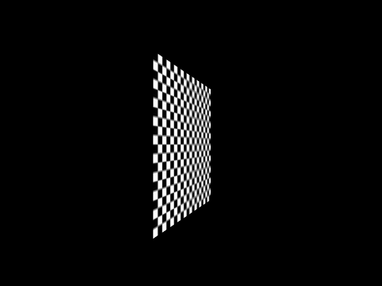

# DirectX12Lab

My personal DirectX 12 Playground.

## 00.init

Initialize Win32 window and DirectX 12 context.

* Window/mouse/keyboard event management
* Multiple frames in flight

## 01.triangle

Render a color triangle.

* Graphics pipeline
* Vertex/pixel shader
* Vertex buffer

## 02.mesh

Render a triangle mesh.

* Constant buffer
* Root signature DSL
* Descriptor heap management
* Depth stencil buffer

## 03.texture

* Texture2D

* Camera

## 04.deferred

* Render to texture
* Simple deferred rendering

## 05.mipmap & msaa

* Mipmap generation and using
* Render target with MSAA

* Reference

  [avir](https://github.com/avaneev/avir)

## 06.imgui

* Dear-ImGui integration

* Reference

  [Dear-ImGui](https://github.com/ocornut/imgui)
  
  [ImGui-Filebrowser](https://github.com/AirGuanZ/imgui-filebrowser)

